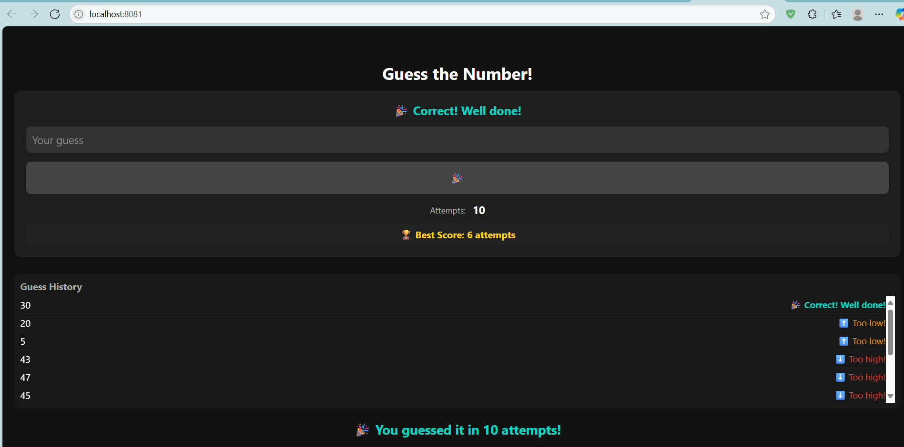

# Awesome Guessing Game



A simple and fun number guessing game built with React Native and Expo. Play on web or mobile! Try to guess the randomly chosen number between 1 and 100 in as few attempts as possible.

## Features
- Random number between 1 and 100
- Tracks your number of attempts
- Shows your best score
- Guess history with feedback (too high/low/correct)
- Works on web, Android, and iOS

## Getting Started

### 1. Install dependencies
```sh
npm install
```

### 2. Start the Expo development server
```sh
npx expo start
```

### 3. Run the app
- **Web:** Press `w` in the terminal or click "Run in web browser" in Expo Dev Tools
- **Android/iOS:** Scan the QR code with Expo Go app

## Folder Structure
- `App.js` - Main app code
- `assets/` - Images and icons (including screenshot.png)

---
Enjoy playing and improving your guessing skills! 